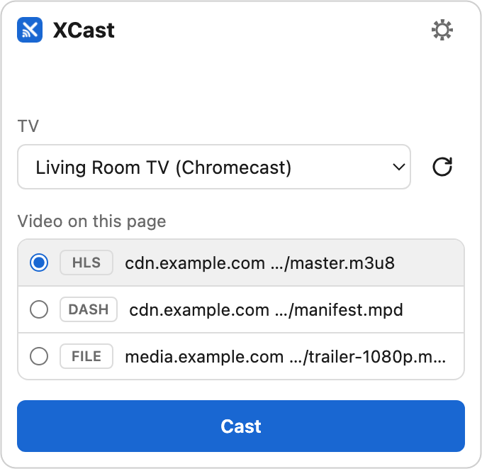
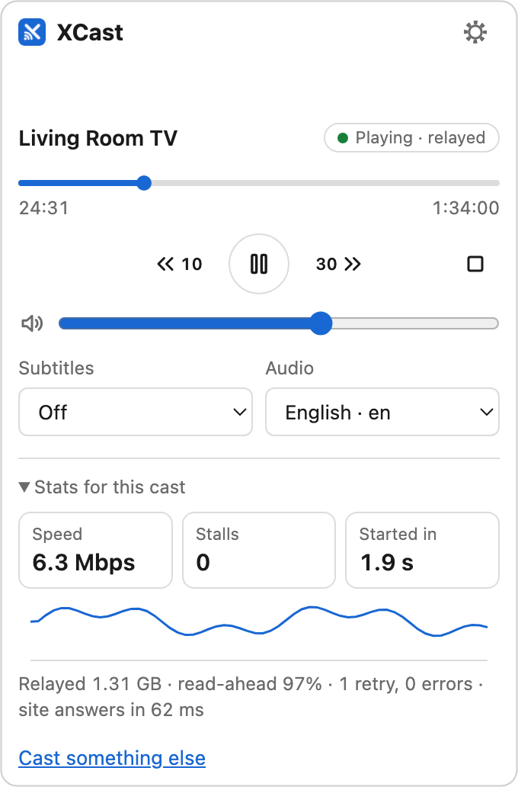
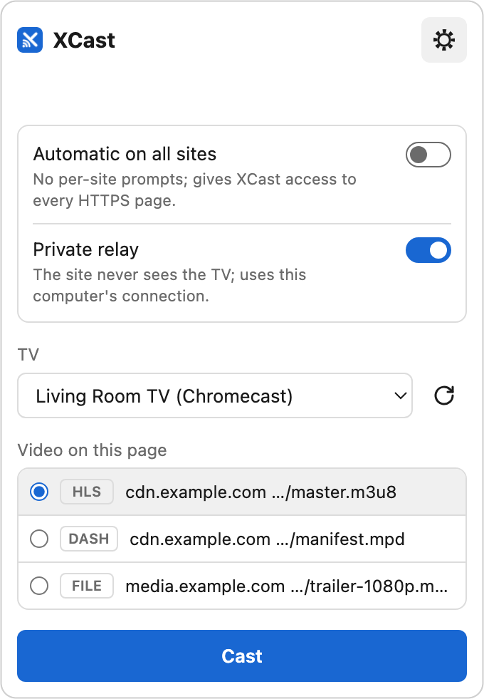
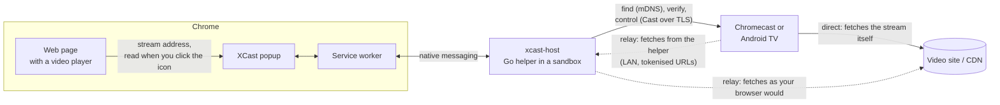
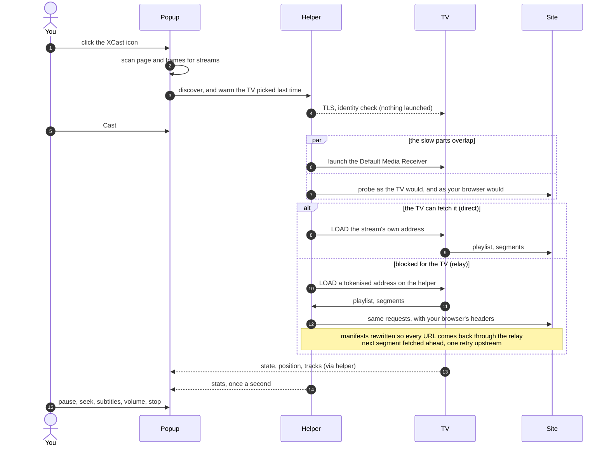
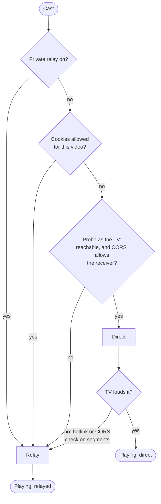
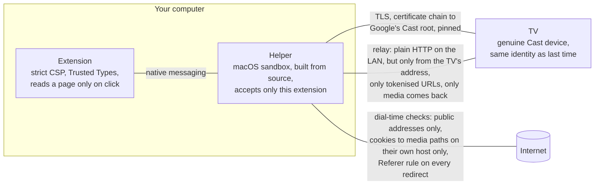

<p align="center">
  
</p>

<h1 align="center">XCast</h1>

<p align="center">
  <b>Cast any web video to your TV. No Cast button required.</b><br>
  A Chrome extension and a small native helper for Chromecast and Android TV.
</p>

<p align="center">
  <a href="#install-macos">Install</a> ·
  <a href="#use">Use</a> ·
  <a href="#how-it-works">How it works</a> ·
  <a href="#security-and-privacy">Security</a> ·
  <a href="#when-it-doesnt-work">Troubleshooting</a> ·
  <a href="#develop">Develop</a>
</p>

---

XCast finds the real video stream on the page and tells the TV to play it. The TV plays the original stream with its own decoder: nothing is captured and nothing is re-encoded. If the site blocks the TV from fetching the video, XCast relays it through your computer, byte for byte.

> **Early software.** It works in our tests. The five issues an independent review found in the relay are [closed in code and covered by tests](SECURITY-ISSUES.md), but relayed DASH (`.mpd`) streams have not been played on a real TV since, and a few lower-priority points remain open. Use it on a network you trust. [What has and has not been tested](docs/HOW-IT-WORKS.md).

<table>
  <tr>
    <td align="center" valign="top">
      <picture>
        <source media="(prefers-color-scheme: dark)" srcset="docs/img/popup-choose-dark.png">
        
      </picture>
      <br><sub><b>Choose</b>: pick a TV and the video</sub>
    </td>
    <td align="center" valign="top">
      <picture>
        <source media="(prefers-color-scheme: dark)" srcset="docs/img/popup-playing-dark.png">
        
      </picture>
      <br><sub><b>Now playing</b>: a small remote</sub>
    </td>
    <td align="center" valign="top">
      <picture>
        <source media="(prefers-color-scheme: dark)" srcset="docs/img/popup-settings-dark.png">
        
      </picture>
      <br><sub><b>Settings</b>: two switches</sub>
    </td>
  </tr>
</table>

## Why not just "Cast tab"?

Chrome's **Cast tab** records the tab, re-encodes it live and streams that recording. XCast hands the TV the stream itself.

| | Cast tab | XCast |
|---|---|---|
| Picture | Re-encoded copy of your screen area | The source stream, the TV's own decoder, the stream's own quality ladder |
| Computer load | Encodes video the whole time | Close to none (direct), or plain network traffic (relay) |
| The tab | Must stay open and keep rendering | Can be closed or reused |
| Computer sleeps | Casting stops | Direct: the TV keeps playing. Relay: it stops |
| On the TV | The whole page: controls, overlays, cursor | Only the video |
| Controls | The page's own, with lag | The popup, the TV remote, or any Cast controller |
| Works for | Anything Chrome can show, including DRM sites | Streams XCast can find and the TV can decode. **No DRM** |

Use Cast tab for Netflix and friends, for pages that are not a video, or where no helper can be installed. Use the site's own Cast button where it has one (YouTube, Twitch, Spotify): that plays through the TV's own app.

## Features

**Finding the video**
- Reads `<video>` elements (also inside open shadow roots) and the page's resource timing entries, so players that only expose `blob:` URLs are found by their manifest.
- HLS (`.m3u8`), DASH (`.mpd`) and files (`.mp4`, `.m4v`, `.webm`, `.mov`), recognised by path or response type, never by query string.
- Keeps looking for about 30 seconds while the popup is open, because many players fetch the stream only once you press play.
- Players embedded from another site: asks for that one site, or never asks again with **Automatic on all sites**.
- Knows where it cannot help: on sites with their own Cast button and on DRM services it says what to use instead.

**Casting**
- **Direct** when the TV can fetch the stream itself, **relay** when it cannot (CORS, Referer, hotlink protection, cookies). A direct load that fails on the TV is retried through the relay once.
- Starts where the page's player was. Pauses the page's player after the cast starts.
- The connection to a TV you have used before is made when the popup opens, so Cast does not wait for the handshake. Nothing is started on the TV until you press Cast.
- Site logins: your cookies are sent only if you say yes, per pair of page and video host, with a louder warning when the two differ.
- If the control connection drops, the helper reconnects (after 1, 3 and 8 seconds) and rejoins the running player.

**The remote**
- TV name, a state pill (playing, paused, buffering; relayed or direct), a progress bar that seeks on click and with the arrow keys, back 10 s, play/pause, forward 30 s, stop, volume.
- **Subtitles and audio tracks** from the stream, picked in the popup.
- The progress bar keeps moving between the TV's reports, and is right again when you reopen the popup.
- **Stats for this cast**: relay speed with a one-minute graph, stalls, start time, data relayed, read-ahead hit rate, retries, how quickly the site answers. In memory for the current cast only, never stored.
- "Cast something else" without stopping what plays.
- Light and dark, keyboard operable, screen-reader labelled.

**Privacy**
- **Private relay**: everything goes through your computer, so the site never sees your TV, and a VPN on your computer covers the TV's traffic too.
- Other hosts get the site's origin as Referer, never the page address; decided again on every redirect.
- The title shown on the TV (and to every Cast controller on your network) is "XCast" plus the site's host name, or just "XCast" with Private relay. Never the page title.
- On the LAN, relay URLs are encrypted tokens: someone watching your network cannot read which site, video or access token is behind a request.

**Security**
- The TV must prove it is a genuine Cast device (certificate chain to Google's Cast root), and the same one as last time (identity pinned on first use).
- The helper runs in a macOS sandbox: it cannot read your files or start other programs. It is built from source on your machine.
- The relay serves only the TV's address, only URLs the helper itself issued, only `GET`/`HEAD`, and only media: pages, JSON, scripts and error bodies are never handed out.
- Upstream connections are checked at dial time, redirects and DNS rebinding included: no pivot into your LAN.
- The extension's pages run under a strict Content Security Policy with Trusted Types; page-controlled and network-controlled strings are only ever shown as text.

## How it works

Chrome extensions may not open sockets, so they can neither find a TV nor talk to one. XCast splits the work: the extension sees the page, the helper talks to the network.



### One cast, step by step



### Direct or relay?



So the pill can say "relayed" with the switch off. The switch means *always* relay; it does not mean relay *only* when on.

The longer version, with what has been tested and how: [docs/HOW-IT-WORKS.md](docs/HOW-IT-WORKS.md).

## Install (macOS)

You need Google Chrome 116 or newer and [Go](https://go.dev/dl/) (`brew install go`). The helper is built from source on your computer, so there is no binary to trust.

```sh
git clone https://github.com/agkloop/chrome_xcast.git
cd chrome_xcast
./install.sh
```

Then load the extension:

1. Open `chrome://extensions` and turn on **Developer mode**.
2. Click **Load unpacked** and choose the `extension` folder.

The first time you use it, macOS asks to let **xcast-host** find devices on your local network. Click **Allow**. If you missed it: System Settings > Privacy & Security > Local Network. macOS asks again after every reinstall.

**Updating:** `git pull`, run `./install.sh` again, and reload the extension in `chrome://extensions`. The two halves are installed separately; if the helper is left behind, the popup says so.

## Use

1. Start the video on the page.
2. Click the XCast icon. It lists the video it found and the TVs on your network.
3. Pick the TV and click **Cast**. The popup turns into the remote.

Keyboard: everything is reachable with Tab. On the progress bar, Left and Right seek by 10 seconds.

Behind the gear:

- **Automatic on all sites.** Off by default: XCast asks before looking inside a player embedded from another site. Turn it on (one Chrome prompt, once) and it never asks again. The price is that XCast then has access to every HTTPS page you visit. Its code still only reads a page when you click the icon.
- **Private relay.** Sends everything through your computer, so the site never sees your TV, and a VPN on your computer covers the TV's traffic too. It uses your computer's connection while the video plays, and the computer has to stay awake.

## When it doesn't work

| What you see | Why, and what to do |
|---|---|
| "Helper not installed" | Run `./install.sh`, then reload the extension in `chrome://extensions`. |
| "The helper is older than this extension" | Run `./install.sh` again. |
| "macOS is blocking local network access" | Allow **xcast-host** under System Settings > Privacy & Security > Local Network. |
| No TV in the list | The TV and the computer must be on the same network. Check with `~/Library/Application\ Support/XCast/xcast-host-sandboxed -discover`. |
| "No video found" | Press play first; XCast keeps looking for about 30 seconds. If the player is embedded from another site, allow the scan it offers, or turn on **Automatic on all sites**. |
| The site has its own Cast button (YouTube, Twitch, Spotify…) | Use that button. It plays through the TV's own app, in better quality. |
| Netflix, Disney+, Prime Video and other DRM services | Cannot be cast this way by any extension. Use Chrome's menu > Cast > Cast tab. |
| "Site needs your login" | The stream wants your cookies. Read what the link under the Cast button says, in particular when it warns that the video is on another host than the page. |
| "This is NOT the TV used before" | The TV's identity changed. Only continue if you replaced or factory-reset it. |
| "… serves this DASH stream from its top directory" | With your cookies in play, XCast refuses a relay grant that would cover the whole site. |
| No Subtitles picker | The picker lists the tracks the TV found *in the stream*. Subtitles a page adds on its own, outside the stream, are not carried over. |

## Security and privacy

The short version of [docs/SECURITY-MODEL.md](docs/SECURITY-MODEL.md):



What XCast does **not** protect against is in the same documents, plainly: the relay link on your LAN is plain HTTP (a Cast receiver does not trust local certificates), so someone who takes over the TV's address can pull the *video* through the relay; and anything already running as you on your computer is out of scope. Issues found in review, closed and open: [SECURITY-ISSUES.md](SECURITY-ISSUES.md).

## Develop

| Part | What it does |
|---|---|
| [`extension/`](extension) | Chrome MV3 extension, plain JavaScript, no dependencies, no build step. `popup.js` finds the video and is the remote; `sw.js` owns the helper connection, which has to outlive the popup; `watch.js` records stream requests from page load on sites you chose. |
| [`host/`](host) | The helper, in Go, standard library only: discovery (`mdns.go`), the Cast protocol and device authentication (`cast.go`, `auth.go`, `chain.go`), stream probing and planning (`media.go`, `host.go`), the relay (`proxy.go`, `prefetch.go`), network policy (`netsec.go`), stats (`metrics.go`). |
| [`install/`](install) | The macOS installer and the sandbox profile the helper runs in. |
| [`testlab/`](testlab) | Local pages that imitate real player setups (cross-origin iframe, `blob:` player behind a Referer check, signed expiring MP4), with generated video. |
| [`docs/`](docs) | How it works, the security model, and the logo. |

```sh
# helper
cd host
go vet ./... && go test -race ./...
go test -run='^$' -fuzz='^FuzzRewriteMPD$' -fuzztime=30s .   # any Fuzz* target

# extension
node --test "extension/test/**/*.test.mjs"

# test lab (needs ffmpeg once, for the test video)
testlab/make-media.sh
python3 testlab/server.py
```

Every pull request runs `go vet`, the tests under the race detector, staticcheck, govulncheck and the extension checks ([`.github/workflows/ci.yml`](.github/workflows/ci.yml)). Everything that parses bytes someone else chose (playlists, manifests, mDNS replies, Cast frames, native messages) has a fuzz target.

The logo is [`docs/img/logo.svg`](docs/img/logo.svg). The extension's icons are rendered from it:

```sh
for s in 16 32 48 128; do rsvg-convert -w $s -h $s docs/img/logo.svg -o extension/icons/icon$s.png; done
```

## Known limits

- **DRM streams won't work.** Netflix, Disney+, Prime and other Widevine-protected streams can't be cast this way. Use Chrome's built-in "Cast tab" for those.
- **The TV has to be able to decode the stream.** Nothing is transcoded. A stream in a format or codec your TV does not play fails to load.
- **The proxy link between computer and TV is plain HTTP**, because the receiver does not trust local certificates.
- **Same-user malware is out of scope.** Anything running as you can replace the helper binary or the native messaging manifest. The hardened runtime and the baked-in origin raise the bar; they do not remove this.
- **Your cookies go only to media.** With cookies allowed, they are sent to playlists, manifests, segments and `.key` files, never to an address without a media file extension. A stream whose playlist or key address has no such extension and needs your login will not play.
- **Partitioned (CHIPS) cookies are not read**, so some embedded players that rely on them will fail to authenticate.
- **Subtitles outside the stream are not carried over**: only the tracks the TV finds in the HLS or DASH stream can be picked.
- **The helper needs macOS's Local Network permission, again after every reinstall.** Chrome hands responsibility for a native host to the host itself, so the permission belongs to `xcast-host`, not to Chrome. macOS identifies the binary by its code-signature hash, and an ad-hoc signed binary gets a new hash whenever it is rebuilt from changed source. After each install, allow "xcast-host" in System Settings > Privacy & Security > Local Network (macOS prompts on first use). Signing with a stable identity (Developer ID or a self-signed code-signing certificate) would make the permission survive rebuilds.
- **macOS only** for now: the installer and the sandbox are macOS-specific. The helper already builds for Linux; Windows needs code changes.

## Uninstall

```sh
./uninstall.sh          # keeps the list of TVs you trusted
./uninstall.sh --all    # removes that too
```

Then remove XCast in `chrome://extensions`.
